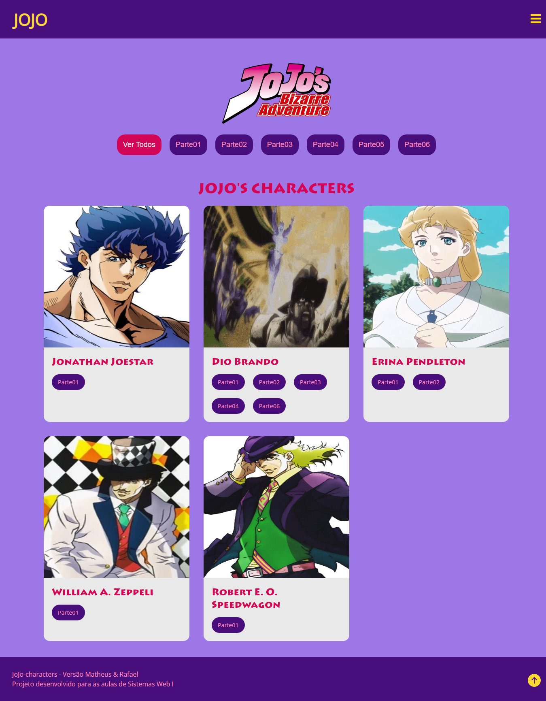
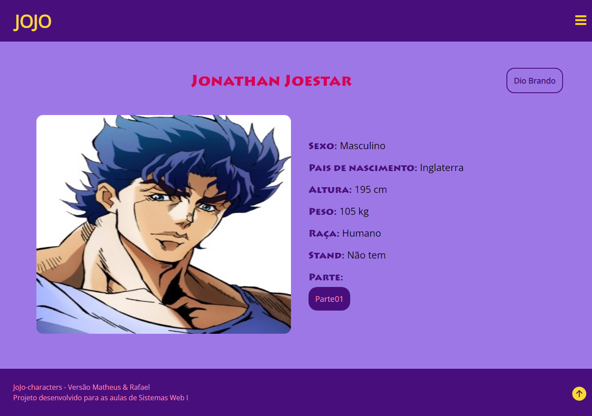

<h1 align="center">JOJO Characters</h1>

<h2 align="justify">Projeto desenvolvido em dupla durante as aulas da disciplina Sistemas Web I, Professor: José Antonio Gallo Junior - 2º ano do Ensino Médio com Habilitação Profissional de Técnico em Informática para Internet, ETEC Comendador João Rays, 1º/2º Bimestre.</h2>

<br>

## Tópicos
- [Algumas telas do projeto](#telas)
- [Executando o projeto](#execute)
- [Descrição do projeto](#desc)
- [Tecnologias utilizadas](#tec)
- [Status do projeto](#status)  
- [Desenvolvedores do projeto](#devs)
- [Licença](#license)

<br>

<h2 id="telas">👀 Algumas telas do projeto</h2>

<h3>Página Inicial</h3>

<p align="left">
  
</p>

<br>

<h3>Personagem Clicado</h3>

<p align="left">
  
</p>

<br>

<h2 id="desc">📚 Descrição do projeto</h2>

<p align="justify">
    O projeto é um site sobre o anime JoJo No Kimyou Na Bouken, ele lista alguns dos personagens do anime da parte 1 até a parte 6 e também algumas informações desses personagens, além de filtrá-los por parte.
</p>

<br>

<h2 id="execute">📋 Executando projeto</h2>

<h3>Pré-requisito</h3>

- [.NET 6.0](https://dotnet.microsoft.com/pt-br/download/dotnet/thank-you/sdk-6.0.417-windows-x64-installer)

<h3>Passo a passo</h3>

```bash
# Clone este repositório
$ git clone https://github.com/Fel1324/JOJO-Characters.git

# Acesse a pasta do projeto no terminal/cmd
$ cd JOJO-Characters

# Com o .NET instalado execute os seguintes comandos
$ dotnet restore
$ dotnet clean
$ cd JOJO-Characters

# Por fim, para iniciar o projeto execute o comando abaixo
$ dotnet run

O servidor irá iniciar em -> https://localhost:7227
```

<br>

<h2 id="tec">🚀 Tecnologias utilizadas</h2>

* CSHTML e CSS
* Javascript
* Git e Github
* C# e .NET

<br>

<h2 id="status">🚧 Status do projeto</h2>

<p>✔ Projeto finalizado</p>

<br>

<h2 id="devs">👨‍💻 Desenvolvedores do projeto</h2>

* Matheus Nunes Bertolini
* Rafael Roberto de Oliveira

<br>

<h2 id="license">📝 Licença</h2>

O projeto está sob a licença MIT.
