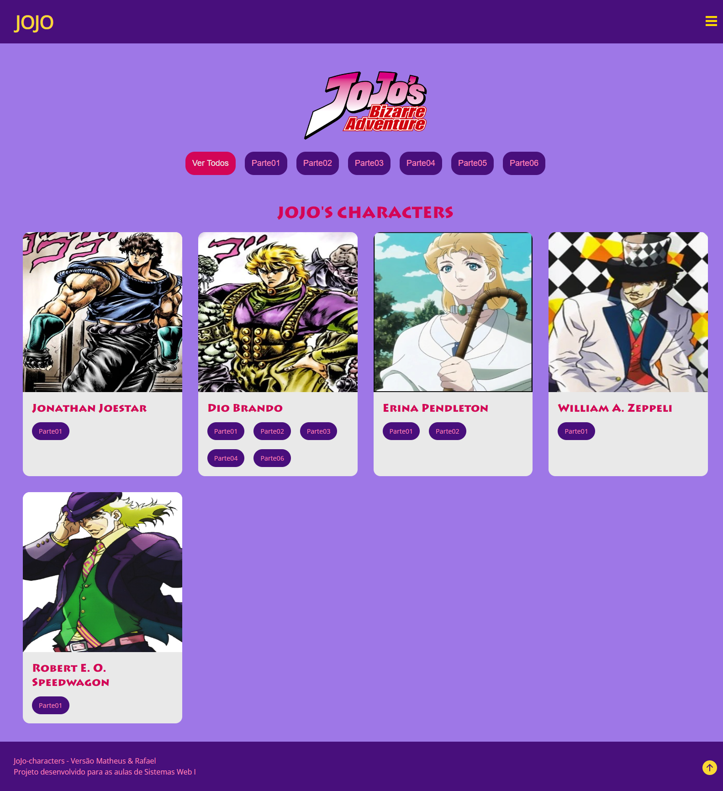
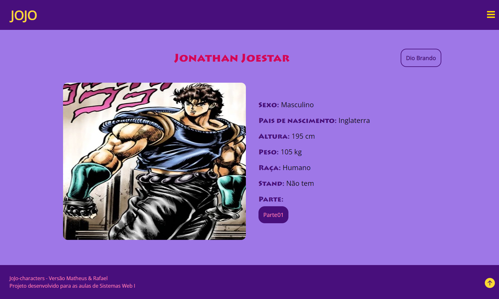

<h1 align="center">JOJO Characters - Trabalho ETEC 2ºMTEC</h1>

<h2 align="justify">Projeto desenvolvido em dupla durante as aulas de Sistemas Web I da série 1ºMtecPi da Etec Comendador João Rays.</h2>

 

## Tópicos
- [Imagem do projeto](#img)
- [Descrição do projeto](#desc)
- [Funcionalidades do projeto](#func)
- [Tecnologias utilizadas](#tec)
- [Status do projeto](#status)  
- [Desenvolvedores do projeto](#devs)
- [Licença](#license)

 

<h2 id="img">👀 Imagem do projeto</h2>

<h3>Página Inicial</h3>

  

 

<h3>Personagem Clicado</h3>

  

 

<h2 id="desc">📚 Descrição do projeto</h2>

    O projeto é um site sobre o anime JoJo No Kimyou Na Bouken.

 

<h2 id="func">⚙ Funcionalidades do projeto</h2>

    O projeto lista personagens do anime JoJo No Kimyou Na Bouken da parte 1 até a parte 6 e também algumas informações desses personagens, além de filtrar os personagens por parte. 

 

<h2 id="tec">🚀 Tecnologias utilizadas</h2>

* HTML e CSS
* Javascript
* Git e Github
* C# e dotnet

 

<h2 id="status">🚧 Status do projeto</h2>

✔ Projeto finalizado

 

<h2 id="devs">👨‍💻 Desenvolvedores do projeto</h2>

* Matheus Nunes Bertolini
* Rafael Roberto de Oliveira

 

<h2 id="license">📝 Licença</h2>

Esse projeto está sob a licença MIT.
